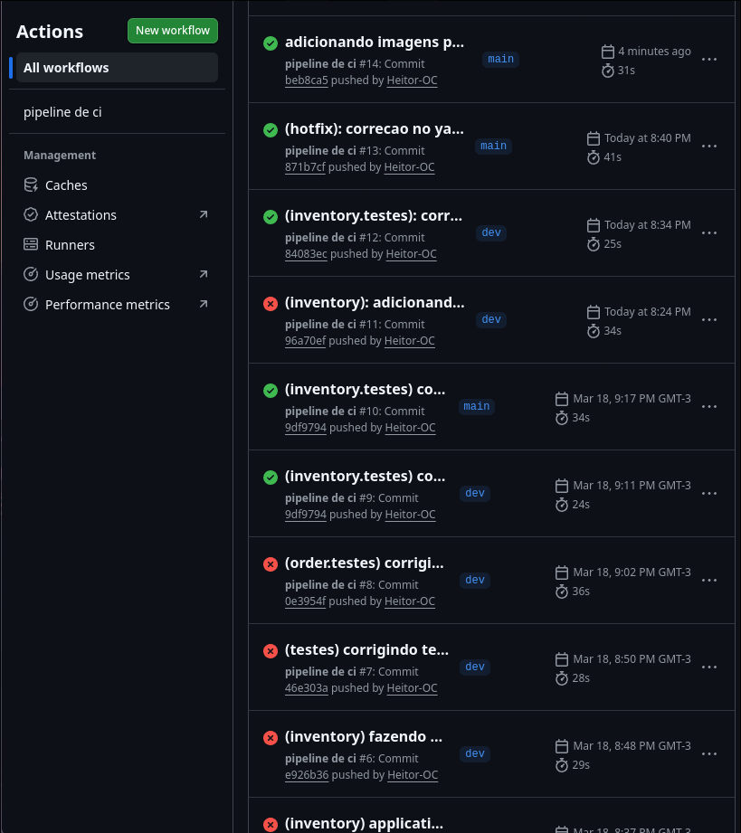
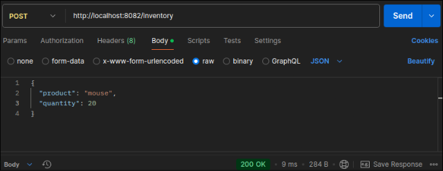
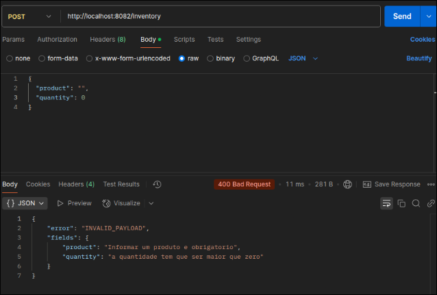
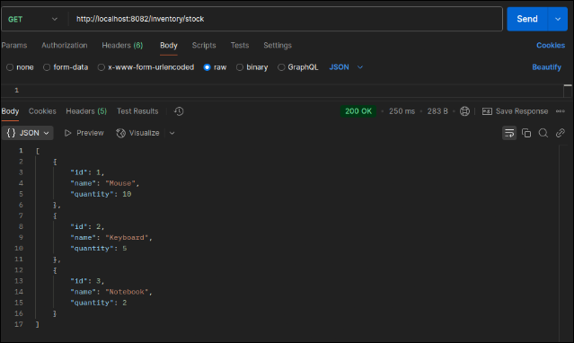
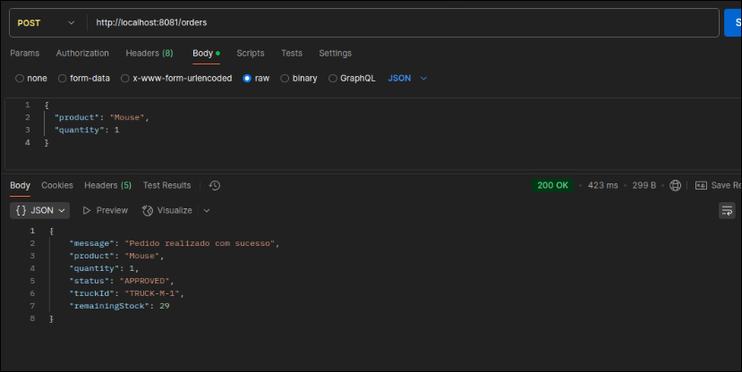
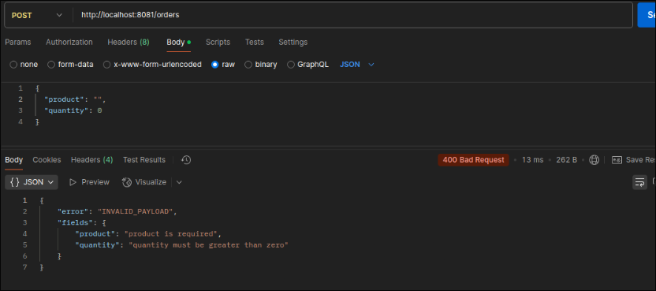
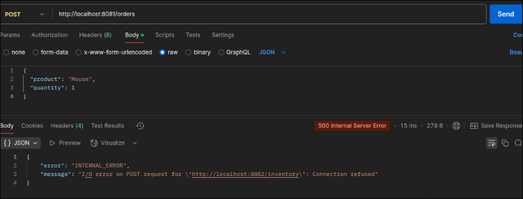

# 1. VISÃO GERAL

Este projeto consiste em uma aplicação de microsserviços composta por dois serviços principais:

- **Order Service** que recebe e processa pedidos  
- **Inventory Service** que gerencia o estoque, valida a disponibilidade de produtos e realiza a triagem para o transporte.  

## Fluxo Principal

- O cliente envia um pedido para o order service  
- O pedido é encaminhado ao inventory service pelo order service  
- O inventory service valida o estoque para aprovar ou rejeitar (por falta de estoque, etc)  

Além disso, o sistema permite a consulta de estoque disponível  

## Use Cases

### Order Service

1. **Criar pedido válido**  
O sistema deve receber um pedido com produto e quantidade válidos e encaminhá-lo ao serviço de estoque.  

2. **Confirmar pedido quando o estoque aprovar**  
Quando o inventory-service retornar aprovação, o pedido deve ser considerado criado com sucesso.  

3. **Rejeitar pedido quando não houver estoque**  
Quando o inventory-service retornar rejeição por falta de estoque, o order-service deve retornar erro/regra de falha.  

4. **Rejeitar requisição com payload inválido**  
O sistema não deve aceitar pedido sem produto ou sem quantidade.  

5. **Expor endpoint HTTP para criação de pedidos**  
O sistema deve disponibilizar POST /orders para receber pedidos em JSON.  

6. **Encapsular integração com serviço externo**  
A comunicação com o serviço de estoque deve acontecer por meio de um client dedicado.  

---

### Inventory Service

1. **Aprovar movimentação quando houver estoque suficiente**  
Se a quantidade pedida estiver disponível, o estoque deve aprovar a operação.  

2. **Rejeitar movimentação quando não houver estoque suficiente**  
Se a quantidade solicitada ultrapassar a quantidade disponível, a operação deve ser rejeitada.  

3. **Dar baixa de estoque em pedido aprovado**  
Quando aprovado, o sistema deve reduzir a quantidade disponível do item.  

4. **Atribuir caminhão para envio em pedido aprovado**  
Quando aprovado, o sistema deve retornar um identificador de caminhão.  

5. **Expor endpoint HTTP para processamento de estoque**  
O sistema deve disponibilizar POST /inventory para receber solicitações de baixa.  

6. **Rejeitar payload inválido**  
O sistema não deve aceitar produto ausente ou quantidade inválida.  

7. **Consultar estoque disponível**  
O sistema deve permitir a consulta dos produtos e suas quantidades em estoque por meio de um endpoint.  

---

# 2. ARQUITETURA

A arquitetura escolhida foi a de microsserviços, por ter separação clara de responsabilidades:

## 🔹 Order Service
- Recebe requisições externas  
- Valida payload  
- Encapsula a comunicação com o inventory-service  
- Decide o resultado do pedido com base na resposta recebida  

## 🔹 Inventory Service
- Responsável pela regra de negócio de estoque  
- Realiza validação de disponibilidade  
- Atualiza quantidades  
- Retorna status da operação (APPROVED / REJECTED)  

## 🔹 Padrões utilizados
- Separação em camadas (controller, serivce, repository, etc)  
- Client dedicado para integração entre serviços  
- Princípio de responsabilidade única (SOLID)  

---

# 3. TECNOLOGIAS UTILIZADAS

As principais tecnologias utilizadas foram:

- Java + Spring Boot  
- Spring Web  
- Spring Data JPA  
- Banco em memória H2  
- JUnit 5 para testes  
- Mockito para mocks  
- GitHub para versionamento  
- GitHub Actions ( pipeline de CI)  
- Postman para testes manuais dos endpoints e regras de negócio (exceptions)  

---

# 4. PIPELINE (CI)

  

Foi implementado um pipeline utilizando GitHub Actions com os seguintes objetivos:

- Executar build automaticamente a cada push  
- Rodar todos os testes (unitários e integração)  
- Garantir que o código só evolua se estiver estável  
- Feedback rápido de falhas  
- Padronização do processo de integração  

Gatilhos de execução foram criados para executar o pipeline automaticamente sempre que houver algum push ou pull request tanto na main, quanto na dev branch para que as alterações sempre sejam validadas.  

Também houve a divisão em mais de um branch para que mudanças possam ser aplicadas de forma mais organizada seguindo o versionamento, isolar código, reduzir riscos de quebrar a versão estável, facilitar revisões, etc.  

A branch main é a versão principal e mais estável e possui apenas código totalmente validado pela pipeline. Enquanto isso, a branch dev é para desenvolvimento contínuo de novas funcionalidades antes de serem promovidas para a main  

## Workflow

Para cada job, o pipeline realiza um checkout do código, clonando o repositório para o ambiente de execução do Actions, configuração do ambiente java e executa os testes baseando-se no próprio diretório do projeto de cada serviço  

## Possíveis melhorias futuras

- Adicionar etapa de build (mvn package)  
- Publicação de artefatos  
- Deploy automático em ambiente de teste  
- Implementar Testes end-to-end entre os serviços  
- Implementar Testes de contrato  

---

# 5. TESTES & TDD

Toda a estratégia de desenvolvimento foi baseada em TDD  

Os testes foram escritos logo no início do desenvolvimento, juntamente com as classes mínimas para a existência dos mesmos para garantir cobertura de regras de negócio e que o pipeline funcionasse desde o início.  

Somente após a implementação dos testes base e do pipeline, o desenvolvimento das funcionalidades dos serviços foi iniciado.  

## Testes implementados:

### Unitários
Com foco nos controllers e services, uso de Mockito para dependências  

Exemplo:
- validação de respostas do controller  
- simulação de aprovação/rejeição de pedidos  

### Integração

Verificação de:
- endpoints reais  
- persistência de dados  
- fluxo completo da aplicação  
- H2  

---

# 6. ENDPOINTS & POSTMAN

## 🔹 Inventory Service

- POST /inventory → Processa uma solicitação de estoque

  

  

- GET /inventory/stock → Retorna todos os produtos disponíveis em estoque  

  

## 🔹 Order Service

- POST /orders → Cria um novo pedido

  

  

  

## Testes via Postman

- Inventory Service  
  - /inventory (POST)  
  - /inventory/stock (GET)  

- ORDER SERVICE  
  - /orders (POST)  

---

# 7. REFLEXÃO TÉCNICA

Durante o desenvolvimento, a construção do pipeline foi guiada por decisões técnicas que impactaram diretamente a qualidade e a confiabilidade do software, além de melhorarem a testabilidade, principalmente das regras de negócio e funcionalidades, e organização do código.  

## 🔹 Decisões técnicas relevantes

Uma das principais decisões foi adotar o TDD e começar a implementar os testes e pipeline desde o início do projeto.  

Antes de começar a implementação das funcionalidades, foram definidos testes unitários e de integração mínimos para garantir uma base mais organizada desde as primeiras versões.  

O GitHub Actions foi utilizado para implementar o pipeline e executar automaticamente esses testes sempre que houvesse um push ou pull no repositório, assegurando que nenhuma alteração fosse integrada sem validação prévia.  

Outra decisão importante foi implementar tanto testes unitários quanto testes de integração, pois dessa forma foi possível testar constantemente as regras de negócio e funcionalidades e ao mesmo tempo a integração entre os diferentes componentes (serviços, banco de dados, etc).  

Utilizar H2 como banco de dados para testes para auxiliar na simplicidade e velocidade do projeto e mockar dependências com Mockito nos testes de controller também foram escolhas que permitiram manter o pipeline rápido e confiável.  

---

## 🔹 Impactos da ausência de testes automatizados

A ausência de testes automatizados comprometeria significativamente o processo de integração contínua, pois:  

Se os testes automatizados naõ tivessem sido implementados iria haver comprometimento no processo de desenvolvimento, pois erros que surgiram durante o desenvolvimento do código não seriam notados tão facilmente e só seriam identificados em produção.  

Sem contar que alterações simples poderiam quebrar funcionalidades inteiras já existentes e validadas.  

Sem os testes o pipeline é apenas um processo de build, o que diminui a confiança no código e não garante qualidade na solução final em produção.  

---

## 🔹Possíveis pontos de evolução

É possível evoluir o pipeline atual para que também integre um processo de CD além do CI que já foi implementado.  

Isso permitiria o deploy automático depois de receber sucesso nos testes, execução de testes adicionais como os E2E, versionamento automático, entre outros que reduziriam ainda mais o tempo de desenvolvimento e entrega e auxiliariam na qualidade e segurança.  

---

## 🔹 Aprendizados

Houveram diversos aprendizados, especialmente quando se trata da parte prática de implementação tanto do pipeline quanto do TDD.  

Com esse projeto, pude pesquisar e aprender mais tirando minhas dúvidas sobre como organizar o processo de desenvolvimento utilizando o TDD.  

Acredito que o principal aprendizado foi quanto à ordem de implementação prática e estruturação dos projetos.  

Percebi que não poderia simplesmente implementar logo de início os testes completos e o pipeline completo, pois deveria fazer uma parte base para garantir que as classes mínimas e testes mínimos estariam ali antes mesmo do pipeline.  

Dessa forma, evitei perder muito tempo organizando erros simples de importação, etc.  

Outro ponto importante foi o fato de que ao desenvolver dessa forma, coisa que nunca tinha feito antes, o processo foi incremental e evolutivo (já que apenas o mínimo do código e testes tinha sido implementado).  

Por isso, foi necessário que durante todo o desenvolvimento houvessem alterações nos testes, código e pipeline para que fossem evoluindo em conjunto com todo o processo de desenvolvimento, versionamento, crescimento das branches, implementação de novas funcionalidades, componentes como o banco de dados, etc.  

Um dos principais aprendizados foi que, ao utilizar TDD, é necessário primeiro estruturar:  

---

## 🔹 Conclusão

A integração entre TDD e CI demonstrou ser essencial para manter qualidade, previsibilidade e segurança no desenvolvimento.  

O pipeline deixou de ser apenas uma ferramenta de automação e passou a atuar como um mecanismo central de validação contínua do software.  

Particularmente, com essa experiência e contato que tive com essas tecnologias, sinto que é bem mais simples e direto implementar todo esse processo e com certeza vou utilizar pipelines em todos os meus projetos daqui para frente.  

Também gostei bastante do contato com o TDD e pretendo utilizá-lo mais vezes se o escopo do projeto permitir.
